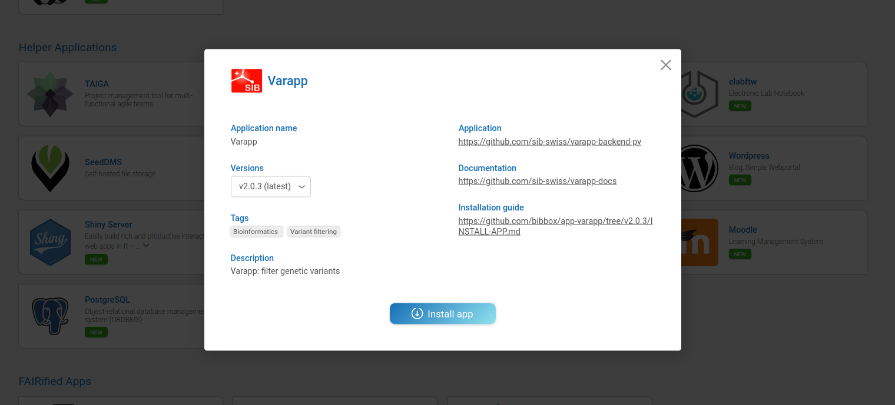
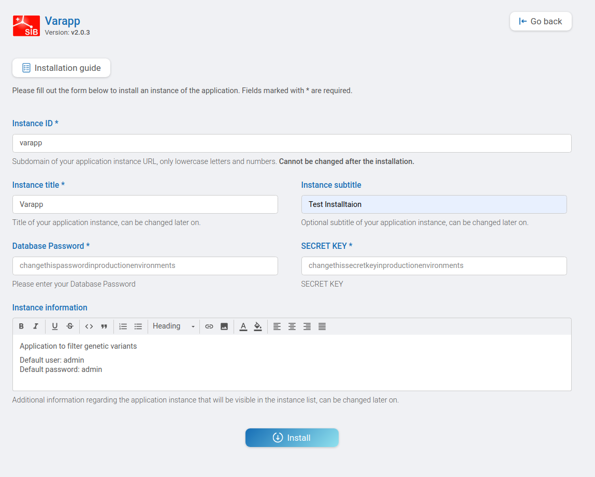
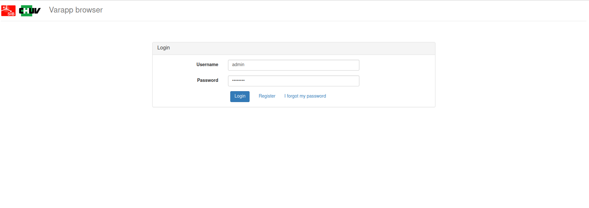
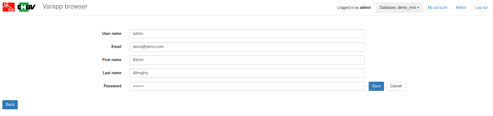
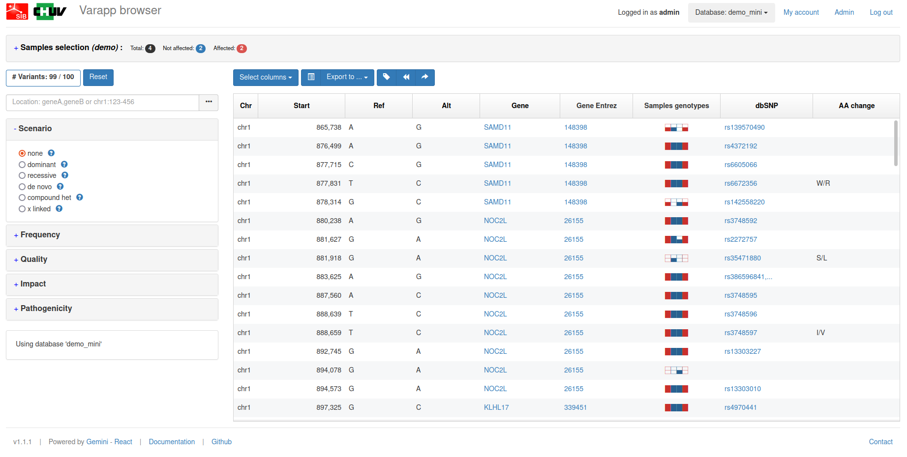

# Varapp Installation Instructions 
The application can be installed either within the BIBBOX environment or as a stand-alone solution. Installation instructions can be found within the BIBBOX, followed by setup instructions required once the application has been successfully installed.

## Installation within in the BIBBOX

Once you've selected the desired App for your BIBBOX instance, you can choose from the available versions, as shown in the following figure.



Clicking "Install App" will open a new window, as illustrated in the following figure. Here, you can define the necessary entries. Some fields come pre-filled with suggested options, and if left unchanged, these default values will be used as the entries.



After confirming by clicking "Install," the App will be installed as a BIBBOX instance. Once the installation is complete, you only need to follow a few steps to use the App for the first time, which are described below.

## Setup after BIBBOX or stand-alone installation

### Start Varapp

Be patient this can take up to 5 minutes.

### Login 

The default admin username is `admin`. The admin password is `admin`.



### Change your admin password

Please change your admin password immediately after the installation in the `My Account` tab:



### You are ready to use Varapp and filter yout variants



### Load Your Data

- Create a sqllite database from your vcf file e.g. using [gemini](https://gemini.readthedocs.io/en/latest/):
```
gemini load -t all -v <path to VCF file> -p <path to PED file> <name of output db>
e.g.
gemini load -t all -v my.vcf -p my.ped my.db
```
- Make sure that the following colums are present in the variants table of your database (`gemmini db_info <path to db file>`):
   - FS `FLOAT`
   - SOR `FLOAT`
   - BaseQRankSum `FLOAT`
   - MQRankSum `FLOAT`
   - ReadPosRankSum `FLOAT`
   - AF `FLOAT`
- NOTE you need to add theses colums if they are not in the db.
- Copy your db file to the `data/resources/db` folder of varapp.
- Execute the following command to copy the db in the correct directory inside the docker container:
```
docker exec -it <instance_id>-varapp-backend cp /db/<your db file> /app/resources/db/
e.g.
docker exec -it bibbox-varapp-backend cp /db/my.db /app/resources/db/
```

- For the next steps you need access to the varapp mysl database. You might want to use Adminer or a similar tool (server: `<instance_id>-varapp-mysql`, username: `root`, password: `<set during installation on the bibbox; default: pwd>`):
- To access the db you need to add one row to the `db_accesses` table of the `users_db` (runnning at <instance_id>-varapp-mysql). To get the `variants_db_id` check the `variants_db` table. 
- Add new item to `db_accesses`:
   - `is_active`: 1
   - `user_id`: 1 `# This is the admin user if you want to give another user access to this db use the id of that user from the users table.`
   - `variants_db_id`: `<id of variant db>` `# (e.g. 2 Check the variants_db table for the id.)`
- DONE :)

## After the installation
Have a nice ride with the Admins youngtimer.


